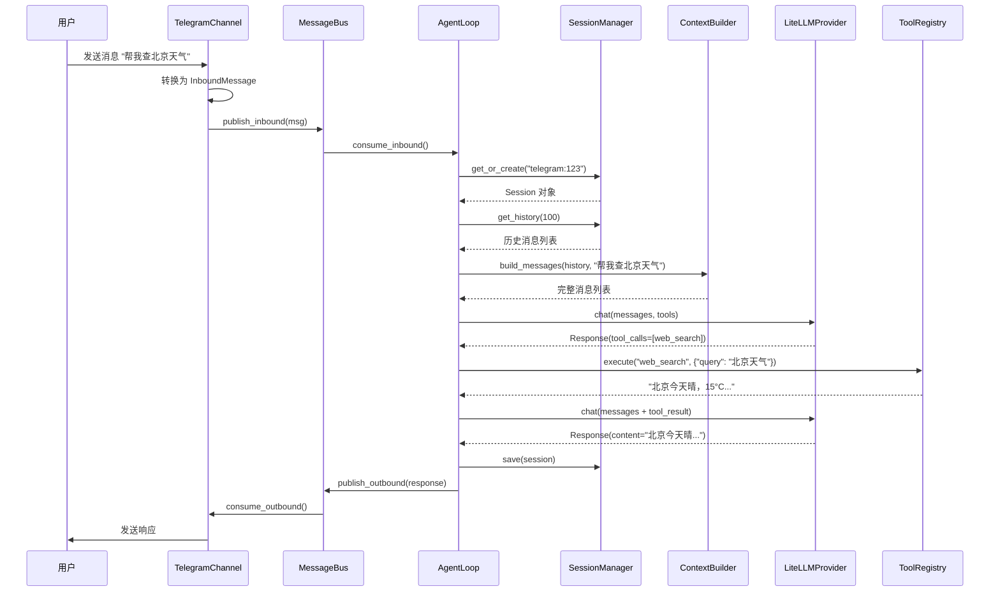

# 消息流转：从 Telegram 到 LLM 再回来

> 核心问题：一条消息是如何在系统中流动的？

## 完整流程

```
用户: "帮我查北京天气"
    │
    ▼
┌─────────────────────────────────────────────────────────────┐
│ 1. TelegramChannel.receive()                                 │
│    将 Telegram Update 转换为 InboundMessage                   │
└────────────────────────┬────────────────────────────────────┘
                         │ InboundMessage(channel="telegram", ...)
                         ▼
┌─────────────────────────────────────────────────────────────┐
│ 2. MessageBus.publish_inbound()                              │
│    将消息放入入站队列                                         │
└────────────────────────┬────────────────────────────────────┘
                         │
                         ▼
┌─────────────────────────────────────────────────────────────┐
│ 3. AgentLoop.consume_inbound()                               │
│    从队列取出消息，开始处理                                   │
└────────────────────────┬────────────────────────────────────┘
                         │
                         ▼
┌─────────────────────────────────────────────────────────────┐
│ 4. SessionManager.get_or_create()                            │
│    获取或创建会话（channel:chat_id）                          │
└────────────────────────┬────────────────────────────────────┘
                         │
                         ▼
┌─────────────────────────────────────────────────────────────┐
│ 5. ContextBuilder.build_messages()                           │
│    构建完整消息列表：                                         │
│    - 系统提示词（SOUL.md + USER.md + TOOLS.md + ...）         │
│    - 历史记录                                                 │
│    - 当前消息                                                 │
└────────────────────────┬────────────────────────────────────┘
                         │ messages = [system, history..., user]
                         ▼
┌─────────────────────────────────────────────────────────────┐
│ 6. LiteLLMProvider.chat()                                    │
│    调用 LLM API                                               │
└────────────────────────┬────────────────────────────────────┘
                         │ response (with tool_calls)
                         ▼
┌─────────────────────────────────────────────────────────────┐
│ 7. ToolRegistry.execute("web_search", {"query": "北京天气"})  │
│    执行工具调用                                               │
└────────────────────────┬────────────────────────────────────┘
                         │ tool_result
                         ▼
┌─────────────────────────────────────────────────────────────┐
│ 8. 再次调用 LiteLLMProvider.chat()                           │
│    将工具结果加入消息列表，再次调用 LLM                        │
└────────────────────────┬────────────────────────────────────┘
                         │ final_response
                         ▼
┌─────────────────────────────────────────────────────────────┐
│ 9. SessionManager.save()                                     │
│    保存对话历史到 JSONL 文件                                  │
└────────────────────────┬────────────────────────────────────┘
                         │ OutboundMessage(channel="telegram", ...)
                         ▼
┌─────────────────────────────────────────────────────────────┐
│ 10. MessageBus.publish_outbound()                            │
│     将响应放入出站队列                                        │
└────────────────────────┬────────────────────────────────────┘
                         │
                         ▼
┌─────────────────────────────────────────────────────────────┐
│ 11. TelegramChannel.send()                                   │
│     将 OutboundMessage 转换为 Telegram API 调用               │
└────────────────────────┬────────────────────────────────────┘
                         │
                         ▼
用户收到: "北京今天晴，15°C，空气质量良好"
```

---

## 时序图



---

## 各阶段详解

### 阶段 1-2：消息接收

```python
# nanobot/channels/telegram.py
async def _handle(self, update, context):
    msg = update.message

    # 检查权限
    if not self.is_allowed(str(msg.from_user.id)):
        return

    # 转换为统一格式
    await self._handle_message(
        sender_id=str(msg.from_user.id),
        chat_id=str(msg.chat.id),
        content=msg.text,
    )

# nanobot/channels/base.py
async def _handle_message(self, sender_id, chat_id, content, ...):
    msg = InboundMessage(
        channel=self.name,
        sender_id=str(sender_id),
        chat_id=str(chat_id),
        content=content,
    )
    await self.bus.publish_inbound(msg)
```

**关键点**：
- 权限检查在 Channel 层完成
- 消息格式统一为 `InboundMessage`

### 阶段 3-4：消息分发

```python
# nanobot/agent/loop.py
async def run(self):
    while self._running:
        try:
            msg = await asyncio.wait_for(
                self.bus.consume_inbound(),
                timeout=1.0
            )
        except asyncio.TimeoutError:
            continue

        # 创建任务处理消息
        task = asyncio.create_task(self._dispatch(msg))
        self._active_tasks[msg.session_key].append(task)

async def _dispatch(self, msg):
    async with self._processing_lock:
        response = await self._process_message(msg)
        if response:
            await self.bus.publish_outbound(response)
```

**关键点**：
- 使用 `asyncio.create_task` 不阻塞主循环
- 使用锁保证同一会话的顺序处理

### 阶段 5：上下文构建

```python
# nanobot/agent/context.py
def build_messages(self, history, current_message, ...):
    return [
        {"role": "system", "content": self.build_system_prompt()},
        *history,
        {"role": "user", "content": self._build_runtime_context(...)},
        {"role": "user", "content": current_message},
    ]

def build_system_prompt(self):
    parts = [
        self._get_identity(),           # 基本身份
        self._load_bootstrap_files(),   # SOUL.md, USER.md, TOOLS.md
        self.memory.get_memory_context(),  # MEMORY.md
        self.skills.load_skills_for_context(...),  # 技能
    ]
    return "\n\n---\n\n".join(parts)
```

**关键点**：
- 系统提示词由多个部分组成
- 运行时信息（时间、渠道）单独注入

### 阶段 6-8：LLM 调用与工具执行

```python
# nanobot/agent/loop.py
async def _run_agent_loop(self, messages, on_progress=None):
    iteration = 0

    while iteration < self.max_iterations:
        iteration += 1

        response = await self.provider.chat(
            messages=messages,
            tools=self.tools.get_definitions(),
            model=self.model,
        )

        if response.has_tool_calls:
            # 执行工具调用
            for tool_call in response.tool_calls:
                result = await self.tools.execute(
                    tool_call.name,
                    tool_call.arguments
                )
                messages.append({
                    "role": "tool",
                    "tool_call_id": tool_call.id,
                    "content": result,
                })
        else:
            # 返回最终结果
            return response.content, messages

    return "达到最大迭代次数", messages
```

**关键点**：
- 循环直到 LLM 不再调用工具
- 工具结果追加到消息列表

### 阶段 9-11：响应返回

```python
# nanobot/agent/loop.py
async def _process_message(self, msg):
    ...

    # 保存会话
    self._save_turn(session, all_msgs, len(history))
    self.sessions.save(session)

    return OutboundMessage(
        channel=msg.channel,
        chat_id=msg.chat_id,
        content=final_content,
    )

# nanobot/channels/telegram.py
async def send(self, msg: OutboundMessage):
    await self.app.bot.send_message(
        chat_id=int(msg.chat_id),
        text=msg.content,
        parse_mode="MarkdownV2",
    )
```

---

## 异步流转细节

### 为什么需要 MessageBus？

**没有 MessageBus（紧耦合）**：

```python
# 问题：Agent 必须知道所有 Channel
class AgentLoop:
    async def process(self, telegram_msg, discord_msg, ...):
        if telegram_msg:
            ...
        elif discord_msg:
            ...
```

**有 MessageBus（松耦合）**：

```python
# 好处：Agent 不知道 Channel 的存在
class AgentLoop:
    async def run(self):
        msg = await self.bus.consume_inbound()  # 统一接口
        await self._process(msg)
```

### 并发处理

```python
# 多个 Channel 同时工作
async def main():
    bus = MessageBus()
    agent = AgentLoop(bus=bus, ...)

    # 并发启动
    await asyncio.gather(
        TelegramChannel(bus=bus, ...).start(),
        DiscordChannel(bus=bus, ...).start(),
        agent.run(),
    )
```

### 消息队列的作用

```
Channel 1 ──┐
Channel 2 ──┼──▶ [inbound queue] ──▶ Agent ──▶ [outbound queue] ──▶ Channels
Channel 3 ──┘
```

1. **缓冲**：消息速度快于处理速度时，队列起到缓冲作用
2. **解耦**：Channel 和 Agent 可以独立启动/停止
3. **顺序**：FIFO 保证消息处理顺序

---

## 源码索引

| 阶段 | 文件位置 |
|------|---------|
| 消息接收 | `nanobot/channels/base.py:86-126` |
| 消息总线 | `nanobot/bus/queue.py:20-34` |
| 代理循环 | `nanobot/agent/loop.py:259-276` |
| 消息处理 | `nanobot/agent/loop.py:330-453` |
| 上下文构建 | `nanobot/agent/context.py:26-53` |
| 工具执行 | `nanobot/agent/loop.py:180-257` |
| 会话保存 | `nanobot/session/manager.py:162-179` |

---

下一章：[07-CONTEXT-BUILDING.md](./07-CONTEXT-BUILDING.md) — 如何让 LLM 理解它所处的环境？
